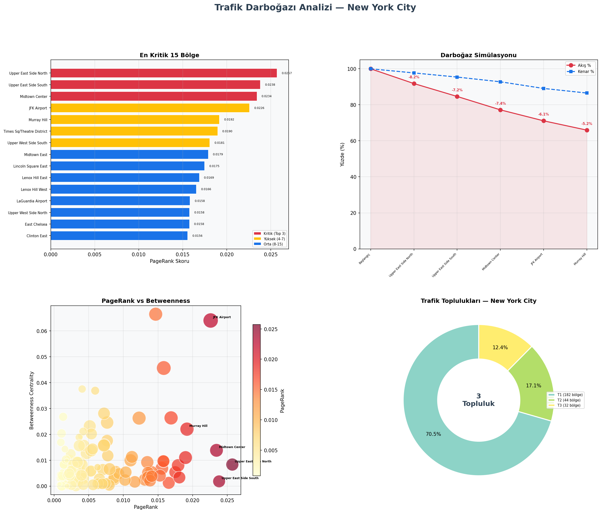
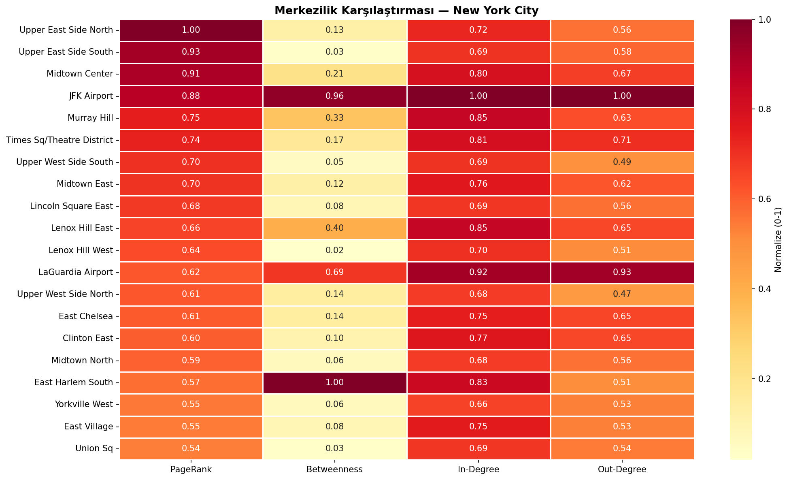
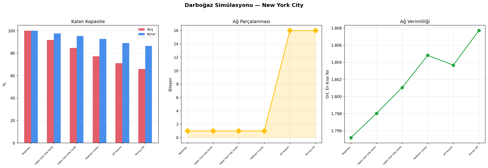
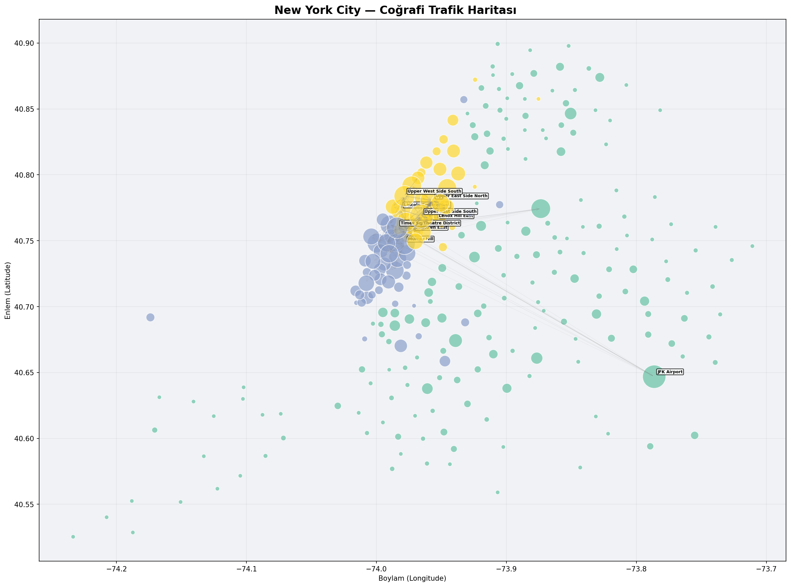
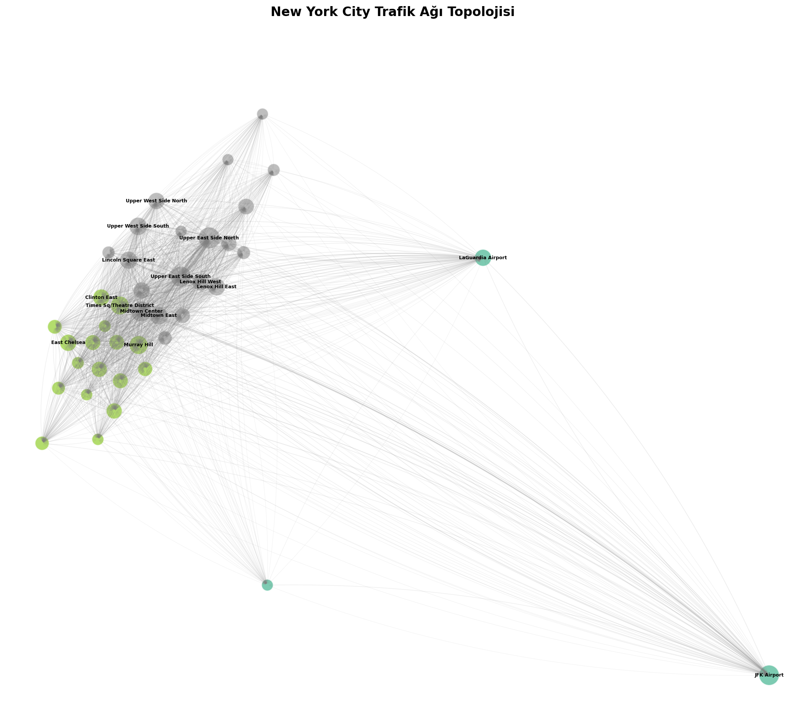
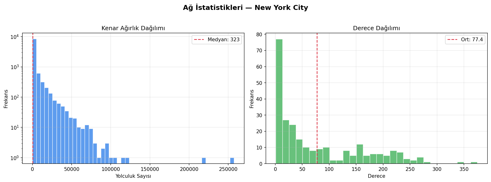

# Akıllı Şehir Trafik Darboğazı Tespiti ve Simülasyonu

### Çizge Analitiği ile Büyük Ölçekli Yolculuk Verisi Üzerinde Yapısal Zayıflık Analizi

**Ders:** CSE458 — Introduction to Big Data Analytics
**Öğrenciler:** Ömer Can Atlı, Kamil Duru
**Depo:** https://github.com/Byomer1021/smart-city-traffic-analysis

---

## Özet

Şehir trafiğini yöneten sistemlerin çoğu noktasal sensör ölçümlerine dayanır:
belirli kavşaklardaki araç sayısını ve hızını ölçerler. Bu yaklaşım bir
kavşağın *kendi başına* ne kadar yoğun olduğunu söyler, ancak ağın bütünü
içinde ne kadar *kritik* olduğunu söylemez. Trafiği az ama iki büyük bölgeyi
birbirine bağlayan tek geçiş noktası, sensör verisinde sıradan görünür;
kapandığında ise etkisi üç mahalle öteye yayılır.

Bu çalışma şehri yönlü ve ağırlıklı bir çizge olarak modelleyerek bu yapısal
zayıf noktaları tespit eder. Düğümler coğrafi bölgeler, kenarlar bölgeler arası
yolculuk talebidir. NYC TLC Yellow Taxi 2023 veri setinin tamamı — 38.310.226
yolculuk kaydı — işlenerek 258 düğümlü ve 9.990 kenarlı bir trafik ağı
kurulmuş, PageRank ile bölgeler yapısal önemlerine göre sıralanmış, Louvain ile
doğal trafik toplulukları çıkarılmış ve ardışık düğüm silme simülasyonuyla
kesinti senaryolarının ağa etkisi ölçülmüştür.

En çarpıcı bulgu, JFK Havalimanı'nın ağdan çıkarılmasının tek parça hâlindeki
ağı **16 ayrı bileşene** bölmesidir. Aynı şekilde East Harlem South bölgesi,
PageRank sıralamasında 17. olmasına rağmen en yüksek betweenness merkeziliğine
sahiptir — hacmi düşük, geçiş rolü en yüksek bölge. Her iki bulgu da hacim
temelli metriklerin tek başına yetersiz kaldığını göstermektedir.

---

## 1. Problem Tanımı

### 1.1 Motivasyon

Büyük şehirlerde trafik tıkanıklığı ölçülebilir ekonomik kayıp üretir: sürücü
başına yılda yüzlerce saat, buna bağlı verimlilik kaybı ve artan karbon
salımı. Mevcut trafik yönetim sistemleri ağırlıklı olarak sabit sensörlere
dayanır ve ağın ilişkisel yapısını göremez.

Bir bölgenin kritikliği iki farklı şeyden gelebilir:

- **Hacim:** çok sayıda yolculuğun başladığı/bittiği yer olması
- **Konum:** ağın başka türlü bağlanamayan iki parçası arasında köprü olması

Sensör verisi yalnızca birincisini yakalar. Bu çalışmanın çıkış noktası,
ikincisinin çizge analitiğiyle ölçülebileceğidir.

### 1.2 Formülasyon

Yönlü ağırlıklı bir çizge `G = (V, E, w)` verildiğinde:

- `V` = trafik bölgeleri (NYC TLC bölgeleri)
- `E` = bölgeler arası yönlü rotalar
- `w(u→v)` = o rotadaki toplam yolculuk sayısı

Aranan küme:

```
S* = arg max  Δ(akış | G − S)
     |S| = k
```

yani silinmesi toplam akışı en çok bozan `k` düğüm.

---

## 2. İlgili Çalışmalar

**Çizge analitiği temelleri.** Leskovec, Rajaraman ve Ullman (2020), seyrek
çizgeler üzerinde iteratif algoritmaları — PageRank dâhil — ele alır ve
çizge-teorik ölçütlerin ham istatistiklerden görünmeyen yapısal özellikleri
ortaya çıkarabildiğini gösterir.

**PageRank ve merkezilik.** Brin ve Page (1998) tarafından web sayfalarını
sıralamak için geliştirilen PageRank, herhangi bir yönlü çizge için genel bir
önem ölçütü olarak çalışır. Ulaşım bağlamında yüksek PageRank'lı bölge, diğer
yoğun bölgelerden trafik çeken bölgedir. Wang vd. (2019) taksi GPS izleri ve
çağrılı taşıma kayıtları üzerinde PageRank tabanlı sıralamaların gerçek
tıkanıklık noktalarıyla iyi örtüştüğünü bildirir.

**Dağıtık çizge işleme.** Zaharia vd. (2016) Spark'ın bellek içi RDD
soyutlamasının PageRank gibi iteratif algoritmaları ölçekte pratik kıldığını
gösterir. Xin vd. (2013), GraphX'in vertex-cut bölümlemeyle MapReduce tabanlı
sistemlere göre iteratif iş yüklerinde büyük hızlanma sağladığını raporlar.

**Akıllı şehir uygulamaları.** Zheng vd. (2014), kentsel hesaplama
tekniklerini derlerken çizge yapılı temsillerin şehrin ilişkisel yapısını
skaler sensör okumalarının yapamadığı biçimde yakaladığına dikkat çeker.

---

## 3. Veri

### 3.1 Kaynak

NYC Taxi and Limousine Commission (TLC) Trip Record Data, NYC Open Data
portalından kamuya açık.

| Özellik | Değer |
|---|---|
| Kapsam | 2023 tam yılı, 12 ay |
| Ham kayıt | 38.310.226 |
| Format | Apache Parquet (sütunlu, sıkıştırmalı) |
| Disk boyutu | 607 MB (ham), 810 MB (dönüştürülmüş) |
| Bölge meta verisi | 265 bölge adı (`taxi_zone_lookup.csv`), 263 centroid (shapefile'dan) |
| Mahremiyet | Resmî olarak raporlanmış ve anonimleştirilmiş |

Aylık dağılım 2,82M (Ağustos) ile 3,52M (Ekim) arasında değişmektedir.

### 3.2 Kullanılan sütunlar

| Sütun | Rol |
|---|---|
| `PULocationID` | Biniş bölgesi → çizge düğümü |
| `DOLocationID` | İniş bölgesi → çizge düğümü |
| `trip_distance` | Anomali filtresi |
| `trip_duration_minutes` | Anomali filtresi; TLC'de yok, biniş/iniş farkından hesaplanır |
| `fare_amount` | Kenar üzerinde toplam ücret (lokal ETL'de filtre değil) |
| `passenger_count` | Taşınan yolcu (lokal ETL'de filtre değil) |
| `pickup_datetime` | Zamansal analiz için okunur |
| `dropoff_datetime` | Süre hesabı |

### 3.3 Bölge koordinatları

TLC shapefile'ı (`taxi_zones.shp`) `EPSG:2263` projeksiyonunda okunup her
bölgenin ağırlık merkezi hesaplanmış, ardından `EPSG:4326`'ya çevrilmiştir.
WGS84 üzerinde doğrudan centroid almak, enlem-boylam derecelerinin eşit
uzunlukta olmaması nedeniyle kaymalı sonuç verir.

---

## 4. Yöntem

### 4.1 ETL

Ham veri altı aşamada temizlenir:

| # | Filtre | Gerekçe |
|---|---|---|
| 1 | `trip_distance > 0` | Sıfır mesafe = iptal/hatalı kayıt |
| 2 | `trip_duration_minutes > 0` | Negatif/sıfır süre = saat hatası |
| 3 | `trip_duration_minutes <= 300` | 5 saati aşan taksi yolculuğu gerçekçi değil |
| 4 | Aynı bölge **ve** mesafe < 0,1 km | Ölçüm gürültüsü |
| 5 | `PULocationID != DOLocationID` | Öz-döngü, bölgeler arası akışa bilgi katmaz |
| 6 | `trip_count >= 50` | Yılda 50'den az yolculuklu rota istatistiksel gürültü |

1–4 arası filtreler **909.157 kaydı** (%2,37) elemiş, geriye **37.401.069**
kayıt kalmıştır. 5 ve 6 numaralı filtreler gruplama sonrası uygulanır ve
grafa giren yolculuk sayısını **35.420.777**'ye indirir.

### 4.2 Çizge inşası

Temizlenmiş veri `(PULocationID, DOLocationID)` çiftlerine göre gruplanır; her
çift için yolculuk sayısı, ortalama süre, ortalama mesafe ve toplam ücret
hesaplanır. Sonuç yönlü ağırlıklı bir `networkx.DiGraph`'tır.

| Özellik | Değer |
|---|---|
| Düğüm | 258 |
| Kenar | 9.990 |
| Toplam akış | 35.420.777 yolculuk |
| Yoğunluk | 0,1507 |
| Ortalama derece | 77,4 |
| Güçlü bağlı bileşen (SCC) | 67 |
| Zayıf bağlı bileşen (WCC) | 1 |

Yoğunluğun 0,15 olması, olası 258 × 257 rotanın yalnızca %15'inin gerçekten
kullanıldığını gösterir — kentsel taksi ağlarında beklenen hub-and-spoke
topolojisiyle uyumludur.

### 4.3 PageRank

```
PR(v) = (1 − α) / N  +  α · Σ  [ PR(u) / out_degree(u) ]
                            u ∈ in(v)
```

`α = 0,85` (Brin ve Page'in özgün değeri), en fazla 100 iterasyon, kenar
ağırlıkları `weight` olarak kullanılır.

PageRank'ın burada tercih edilme sebebi, hacim yerine **bağımlılık** ölçmesidir:
bir bölge, yüksek skorlu başka bölgelerden trafik çekiyorsa yüksek skor alır.

### 4.4 Merkezilik metrikleri

Dört metrik hesaplanır: PageRank, betweenness, in-degree ve out-degree
merkeziliği.

Betweenness, bir düğümün başka düğüm çiftleri arasındaki en kısa yollar
üzerinde bulunma sıklığıdır — köprü rolünün doğrudan ölçüsüdür.

> **Metodolojik not.** Bu metrik başlangıçta `k = min(100, N)` örneklemesiyle
> ve sabit tohum verilmeden hesaplanıyordu; bu, aynı graf üzerinde koşudan
> koşuya değişen sonuçlar üretiyordu. Ara raporla final sunumu arasındaki JFK
> betweenness farkının (0,74 → 1,00) kaynağı budur. Mevcut sürüm 1000 düğüme
> kadar tam hesap yapar ve deterministiktir. Ayrıntı:
> [VERIFICATION.md](VERIFICATION.md) §4.

### 4.5 Topluluk tespiti

Çizge yönsüzleştirilip Louvain algoritması (`seed = 42`) uygulanır. Louvain,
modülerliği yerel olarak en üst düzeye çıkaran hiyerarşik bir yöntemdir ve
şehir hakkında hiçbir ön bilgi kullanmaz.

### 4.6 Darboğaz simülasyonu

PageRank sıralamasındaki ilk `k = 5` düğüm sırayla ağdan çıkarılır. Her adımda
düğümün tüm kenarları silinir ve şu metrikler yeniden ölçülür:

- kalan toplam akış yüzdesi
- kalan kenar yüzdesi
- zayıf bağlı bileşen sayısı
- en büyük bileşendeki ortalama en kısa yol uzunluğu

Bu, projenin ana deneysel katkısıdır: kritikliğin *iddia* değil, ölçüm olarak
gösterilmesi.

---

## 5. Sistem Mimarisi

### 5.1 İki motorlu tasarım

| Katman | Lokal | Dağıtık |
|---|---|---|
| Okuma | `pandas.read_parquet()` | `spark.read.parquet()` |
| Filtreleme | Boolean indeksleme | `filter()` + AQE |
| Toplama | `groupby().agg()` | `groupBy().agg()` |
| Çizge | `networkx.DiGraph` | `GraphFrame` |
| PageRank | `nx.pagerank()` | `graph.pageRank()` (Pregel BSP) |
| Topluluk | Louvain | Label Propagation |
| Çıktı | matplotlib / seaborn | `toPandas()` + matplotlib |

### 5.2 Çalıştırma ortamı

Bildirilen sonuçlar **AWS EC2 t3.xlarge** (4 vCPU, 16 GB RAM, 20 GB EBS,
Ubuntu 24.04 LTS) üzerinde, **Pandas + NetworkX** lokal pipeline'ı ile
üretilmiştir. Uçtan uca süre 40,7 saniye, toplam bulut maliyeti 1 doların
altındadır.

`spark_pipeline/spark_traffic_pipeline.py` dosyasındaki PySpark + GraphFrames
pipeline'ı daha büyük veri setleri için yazılmış ve repoda mevcuttur; ancak bu
raporda bildirilen sayıları üreten motor değildir. İki motorun ETL filtreleri
farklı olduğundan sonuçları da birebir aynı olmaz (bkz.
[VERIFICATION.md](VERIFICATION.md) §5).

38,3 milyon kaydın tek bir düğümde 40 saniyenin altında işlenebilmesi, bu veri
ölçeğinde dağıtık hesaplamanın zorunlu olmadığını gösteren kendi başına anlamlı
bir sonuçtur.

### 5.3 Yeniden üretilebilirlik

`setup_and_run.sh`, boş bir Ubuntu sunucusunda sekiz adımda tüm akışı kurar ve
çalıştırır: sistem paketleri → repo ve sanal ortam → TLC verisinin indirilmesi →
centroid üretimi → şema dönüşümü → aylık birleştirme → analiz → harita verisi.

---

## 6. Sonuçlar

### 6.1 Genel istatistikler

| Metrik | Değer |
|---|---|
| İşlenen ham kayıt | 38.310.226 |
| Temizleme sonrası | 37.401.069 (%97,63) |
| Grafa giren yolculuk | 35.420.777 |
| Düğüm / kenar | 258 / 9.990 |
| Yoğunluk | 0,1507 |
| Topluluk | 3 |
| Çalışma süresi | 40,7 sn (t3.xlarge) |

### 6.2 En kritik bölgeler



*Şekil 1 — Dört panel: en kritik 15 bölge, darboğaz simülasyon eğrisi,
PageRank–betweenness dağılımı ve topluluk dağılımı.*

| Sıra | Bölge | PageRank | Betweenness (norm.) | Tip |
|---|---|---|---|---|
| 1 | Upper East Side North | 0,02573 | 0,13 | Yerleşim |
| 2 | Upper East Side South | 0,02382 | 0,03 | Yerleşim |
| 3 | Midtown Center | 0,02345 | 0,21 | Ticari |
| 4 | JFK Airport | 0,02260 | **0,96** | Ulaşım merkezi |
| 5 | Murray Hill | 0,01918 | 0,33 | Karma |

İlk üç sıra Manhattan'ın yoğun yerleşim ve ticaret çekirdeğidir; bu beklenen
bir sonuçtur ve modelin doğru çalıştığının işaretidir. Asıl bilgi dördüncü
sıradadır.

### 6.3 Merkezilik karşılaştırması: hacim ≠ kritiklik



*Şekil 2 — İlk 20 bölge için normalize PageRank, betweenness, in-degree ve
out-degree.*

Betweenness sıralaması PageRank sıralamasından belirgin biçimde ayrışır:

| Sıra | Bölge | Betweenness (norm.) | PageRank sırası |
|---|---|---|---|
| 1 | East Harlem South | 1,00 | 17 |
| 2 | JFK Airport | 0,96 | 4 |
| 3 | LaGuardia Airport | 0,69 | 12 |
| 4 | Jamaica | 0,56 | 65 |
| 5 | East New York | 0,55 | 51 |

**East Harlem South**, PageRank'ta 17. sırada olmasına rağmen en yüksek
betweenness'a sahiptir. Hacmi ortalama, ancak Manhattan'ın kuzeyi ile Bronx
arasındaki geçişte konumlanmıştır — tam olarak sensör tabanlı sistemlerin
göremeyeceği türden bir kritiklik.

Buna karşılık **Upper East Side South** PageRank'ta 2., betweenness'ta 0,03'tür:
çok yolculuk üretir ama hiçbir şeyin arasında değildir. Kapanması yerel bir
sorundur, sistemik değil.

### 6.4 Darboğaz simülasyonu



*Şekil 3 — Kalan kapasite, ağ parçalanması ve ortalama en kısa yol.*

| Adım | Çıkarılan bölge | Kalan akış | Kalan kenar | Bileşen |
|---|---|---|---|---|
| 0 | — | %100 | %100 | 1 |
| 1 | Upper East Side North | %91,8 | %97,7 | 1 |
| 2 | Upper East Side South | %84,6 | %95,4 | 1 |
| 3 | Midtown Center | %77,2 | %92,8 | 1 |
| 4 | **JFK Airport** | %71,1 | %89,1 | **16** |
| 5 | Murray Hill | %65,9 | %86,5 | 16 |

258 düğümün yalnızca **5'inin** (%1,9) çıkarılması toplam akışın **%34,1'ini**
yok etmektedir. Ağın yoğunlaşma derecesi bu kadar yüksektir.

Asıl bulgu 4. adımdadır: JFK Airport çıkarıldığında ağ **tek parçadan 16
bileşene** düşer. İlk üç düğüm çıkarıldığında bileşen sayısı 1'de kalmıştı —
yani Manhattan çekirdeği kendi içinde fazlasıyla yedeklidir, düğüm kaybını
soğurabilir. JFK ise dış ilçeleri ve havayolu bağlantılarını Manhattan'a
bağlayan tek yapısal köprüdür; koptuğunda ağın kenar bölgeleri birbirinden
ayrılır.

Kenar kaybının yalnızca %10,9 olmasına karşın bileşen sayısının 16'ya
fırlaması, JFK'nin taşıdığı kenarların **sayıca az ama topolojik olarak
yeri doldurulamaz** olduğunu gösterir.

### 6.5 Topluluk yapısı



*Şekil 4 — 258 bölge centroid koordinatlarında; düğüm boyutu PageRank,
renk topluluk üyeliği.*

| Topluluk | Bölge | Oran | Ortalama PageRank | Coğrafi karşılık |
|---|---|---|---|---|
| T1 | 182 | %70,5 | 0,00189 | Dış ilçeler + havalimanları |
| T2 | 44 | %17,1 | 0,00730 | Midtown / Downtown çekirdeği |
| T3 | 32 | %12,4 | 0,01048 | Upper Manhattan |

Louvain algoritması New York'un coğrafyası hakkında hiçbir bilgi almadan
yalnızca yolculuk akışlarından bu üç bölgeyi ayırmıştır. Sınırların gerçek
idari ve coğrafi sınırlarla örtüşmesi, yöntemin geçerliliğine dair güçlü bir
işarettir.

Ortalama PageRank değerlerinin ters sıralı olması dikkat çekicidir: en kalabalık
topluluk (T1, 182 bölge) en düşük ortalama öneme sahiptir. Trafik yoğunluğu
Manhattan'ın küçük ama yoğun çekirdeğinde toplanmıştır.

### 6.6 Ağ topolojisi ve dağılımlar



*Şekil 5 — PageRank'a göre ilk 40 bölge, coğrafi konumda, ağırlıklı kenarlarla.*

Görselleştirme JFK ve LaGuardia'yı Manhattan kümesinden coğrafi olarak kopuk
ama yoğun biçimde bağlı düğümler olarak göstermektedir. Bu, §6.4'teki
parçalanma bulgusunun görsel karşılığıdır.



*Şekil 6 — Kenar ağırlığı (log ölçek) ve düğüm derece dağılımı.*

Kenar ağırlığı dağılımı ağır kuyrukludur: rota başına medyan 323 yolculuk,
buna karşılık birkaç koridor 200.000'in üzerindedir. Derece dağılımı çift
tepelidir — 20'den az bağlantılı çok sayıda çevre bölge ve 150–250+ bağlantılı
bir çekirdek grup. Bu, gerçek dünya ağlarında beklenen güç yasası benzeri
yapıdır.

---

## 7. Bulgular

**1. Manhattan çekirdeği hacmi taşır, ama yedeklidir.**
PageRank'ta ilk üç sırayı Upper East Side ve Midtown alır. Ancak bu üç bölge
tek tek çıkarıldığında ağ tek parça kalmaya devam eder — çekirdek yeterince
sık bağlıdır ki düğüm kaybını soğursun. Bu bölgelerin kapanması ciddi ama
yerel bir sorundur.

**2. Kritiklik ile hacim farklı şeylerdir.**
East Harlem South PageRank'ta 17., betweenness'ta 1.'dir. Upper East Side
South ise PageRank'ta 2., betweenness'ta sondan sıralardadır. Tek bir metrikle
darboğaz tespiti yanıltıcıdır; ikisi birlikte okunmalıdır.

**3. Yapısal köprüler ağın gerçek kırılma noktalarıdır.**
JFK Airport, kenarların yalnızca %10,9'unu taşımasına rağmen çıkarıldığında ağı
16 parçaya böler. Havalimanları coğrafi olarak izole ve sınırlı sayıda
bağlantıyla ana ağa bağlıdır; bu onları yüksek etkili tek nokta arızası hâline
getirir.

**4. Topluluklar gerçek coğrafyayı yeniden keşfeder.**
Algoritma şehri tanımadan Manhattan çekirdeği, Upper Manhattan ve dış ilçeler
ayrımını bulmuştur. Bu, hem yöntemin doğruluğunu destekler hem de trafik
politikası, sinyal koordinasyonu ve acil durum yönlendirmesi için doğal
planlama birimleri önerir.

**5. Bu ölçekte dağıtık hesaplama zorunlu değildir.**
38,3 milyon kayıt tek bir 16 GB'lık makinede 40 saniyenin altında işlenmiştir.
Dağıtık altyapının maliyeti ancak veri tek düğümün belleğine sığmadığında
haklı çıkar.

---

## 8. Kısıtlar

**Yalnızca sarı taksi verisi.** TLC Yellow Taxi kayıtları New York'taki toplam
hareketliliğin bir alt kümesidir; metro, otobüs, özel araç ve çağrılı taşıma
(Uber/Lyft) dâhil değildir. Sonuçlar "taksi ağı" için geçerlidir, "şehir
trafiği" için bir yaklaşımdır.

**Zamansal boyut kullanılmamıştır.** `pickup_datetime` okunmakta ancak saat ve
gün bazlı segmentasyon yapılmamaktadır. Yıllık toplulaştırma, sabah ve akşam
zirvelerinde farklılaşan darboğazları tek bir ortalamada gizler.

**Simülasyon yeniden yönlenmeyi modellemez.** Bir düğüm silindiğinde o düğümden
geçen trafiğin başka rotalara dağılacağı varsayılmaz; kenarlar tümüyle yok
sayılır. Bu, üst sınır niteliğinde bir etki tahmini verir. Gerçek bir kesintide
talebin bir kısmı komşu bölgelere kayacaktır.

**Kenar eşiği keyfîdir.** `trip_count >= 50` eşiği gürültüyü azaltır ama düşük
hacimli fakat yapısal olarak önemli olabilecek rotaları da eler. Eşik
duyarlılığı analizi yapılmamıştır (bkz. [VERIFICATION.md](VERIFICATION.md) §3).

**Louvain sürüm duyarlıdır.** `seed = 42` verilmesine rağmen topluluk
bölünmesi NetworkX sürümüne ve düğüm ekleme sırasına duyarlıdır; 182/44/32
ile 181/46/31 arasında oynayabilmektedir. Toplam düğüm sayısı ve genel yapı
korunur.

**Node2Vec eklentisi ölçülmemiştir.** `gnn_node2vec.py` yazılmış ve
çalışabilir durumdadır, ancak bu raporda bildirilen bir sonucu yoktur. Ayrıca
tam graf yerine `map_data.json` içindeki en yoğun 300 kenarı kullanır; bu,
benzerlik sonuçlarını yüksek hacimli koridorlara doğru yanlı hâle getirir.

**İki motor birebir aynı sonucu vermez.** Lokal ve Spark ETL'lerinin filtre
kümeleri farklıdır. Bildirilen tüm sayılar lokal motora aittir.

---

## 9. Gelecek Çalışma

**Zamansal darboğaz analizi.** Veriyi saat dilimi ve haftanın günü bazında
bölümleyip her dilim için ayrı PageRank ve simülasyon çalıştırmak, sabah ve
akşam zirvelerinde farklılaşan kritik bölgeleri ortaya çıkarır. Veri zaten
gerekli sütunları içermektedir.

**Yeniden yönlenmeli simülasyon.** Silinen düğümün trafiğini en kısa alternatif
rotalara dağıtan bir akış modeli, gerçekçi etki tahmini verir ve "ikincil
tıkanıklık" bölgelerini gösterir.

**Bileşik dayanıklılık skoru.** PageRank, betweenness ve simülasyon etkisini
tek bir eyleme dönüştürülebilir metrikte birleştirmek, şehir planlamacısına
doğrudan öncelik listesi sunar.

**Çok şehirli karşılaştırma.** İstanbul konfigürasyonu hazırdır; İBB Açık Veri
portalından gerçek veri bağlandığında iki şehrin yapısal dayanıklılığı
karşılaştırılabilir. `convert_data.py` ve `auto_config_builder.py` bu akışı
destekler.

**Spark pipeline'ının doğrulanması.** Dağıtık pipeline yazılmıştır ancak aynı
veri üzerinde lokal motorla karşılaştırmalı olarak çalıştırılmamıştır. İki
motorun ETL filtrelerinin eşitlenmesi ve sonuçların karşılaştırılması,
ölçeklenebilirlik iddiasını kanıta bağlar.

**Çok kipli veri.** Metro ve otobüs hareketlilik verisinin eklenmesi, taksi
ağının ötesine geçip gerçek bir şehir hareketlilik ağı kurulmasını sağlar.

---

## 10. Yeniden Üretim

Bu rapordaki tüm sayılar ve şekiller aşağıdaki komutlarla yeniden üretilebilir.
Adım adım rehber ve beklenen çıktı için [VERIFICATION.md](VERIFICATION.md) §7,
modül parametreleri için [MODULES.md](MODULES.md).

```bash
pip install -r requirements.txt

python local_pipeline/traffic_analysis_generic.py \
  --city nyc --data data/nyc/formatted/nyc_trips_2023_all.parquet --top-k 5

python local_pipeline/export_map_data.py \
  --city nyc --data data/nyc/formatted/nyc_trips_2023_all.parquet
```

Şekiller `results/new_york_city/` altına yazılır ve bu depoda mevcuttur.

---

## Kaynakça

Brin, S., & Page, L. (1998). The anatomy of a large-scale hypertextual web
search engine. *Computer Networks and ISDN Systems*, 30(1–7), 107–117.

Grover, A., & Leskovec, J. (2016). node2vec: Scalable feature learning for
networks. *Proceedings of the 22nd ACM SIGKDD International Conference on
Knowledge Discovery and Data Mining*, 855–864.

Leskovec, J., Rajaraman, A., & Ullman, J. D. (2020). *Mining of Massive
Datasets* (3rd ed.). Cambridge University Press.

New York City Taxi and Limousine Commission. *Trip Record Data*. NYC Open Data.
https://www.nyc.gov/site/tlc/about/tlc-trip-record-data.page

Apache Software Foundation. (2023). *Apache Spark GraphX Programming Guide*.
https://spark.apache.org/docs/latest/graphx-programming-guide.html

Wang, Z., Fu, K., & Ye, J. (2019). Learning to estimate the travel time.
*Proceedings of the 25th ACM SIGKDD International Conference on Knowledge
Discovery and Data Mining*, 858–866.

Xin, R. S., Gonzalez, J. E., Franklin, M. J., & Stoica, I. (2013). GraphX: A
resilient distributed graph system on Spark. *First International Workshop on
Graph Data Management Experiences and Systems (GRADES '13)*.

Zaharia, M., Xin, R. S., Wendell, P., Das, T., Armbrust, M., Dave, A., …
Stoica, I. (2016). Apache Spark: A unified engine for big data processing.
*Communications of the ACM*, 59(11), 56–65.

Zheng, Y., Capra, L., Wolfson, O., & Yang, H. (2014). Urban computing:
Concepts, methodologies, and applications. *ACM Transactions on Intelligent
Systems and Technology*, 5(3), 38.
